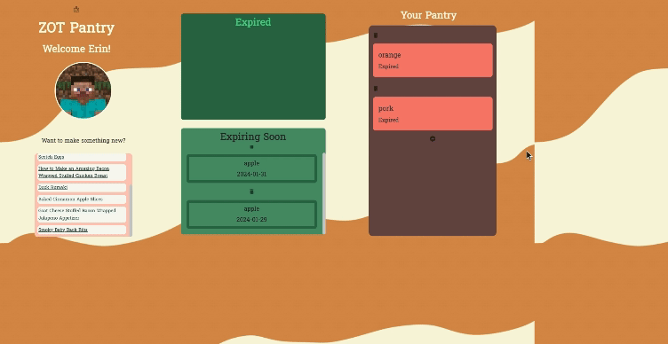

# ZOT Pantry

## Inspiration
In the hustle of daily life, it's easy to forget about the perishable food items we store away. ZOT Pantry was inspired by the common dilemma of food waste. Our goal is to help individuals manage their pantry more effectively, reminding them of what's about to expire and suggesting creative ways to use their ingredients before they go to waste.

## What ZOT Pantry Does
ZOT Pantry is a user-friendly web application that allows users to log their food items and track their expiration dates. Items nearing expiration are flagged as "expiring soon," while those past their dates are marked as "expired." To minimize waste, ZOT Pantry also suggests recipes based on the ingredients you have at hand, ensuring that nothing goes to waste.

## How We Built It
- **Front-end**: Developed with `React`, `JavaScript`, and `CSS`, providing an engaging user experience.
- **Design**: UI mock-ups crafted using `Figma`, ensuring a polished and intuitive interface.
- **Back-end**: Utilized `Node.JS` and the `Spoonacular API` for backend processes, especially for fetching personalized recipe suggestions.

## Setup and Installation
*Instructions on how to get a local copy up and running follow these simple steps.*

1. Clone the repository: https://github.com/ahphung1/irvinehacks-2024.git
2. Install NPM packages: npm install
3. check whether the packages are installed:
   1) node -v
   2) npm -v
4. install dependencies:
   ```
   npm install

   ```
6. Start the development server:
   ```
   cd my-react-app
   npm run build
   npm start

   ```
## Troubleshooting
clean npm cache when encountering certain cache-related issues.

```
 npm cache clean --force
```
## Demo
  

[Deployment](https://uci-food-pantry-e7yrvqs4s-emmeline1101s-projects.vercel.app/): https://uci-food-pantry-e7yrvqs4s-emmeline1101s-projects.vercel.app/

